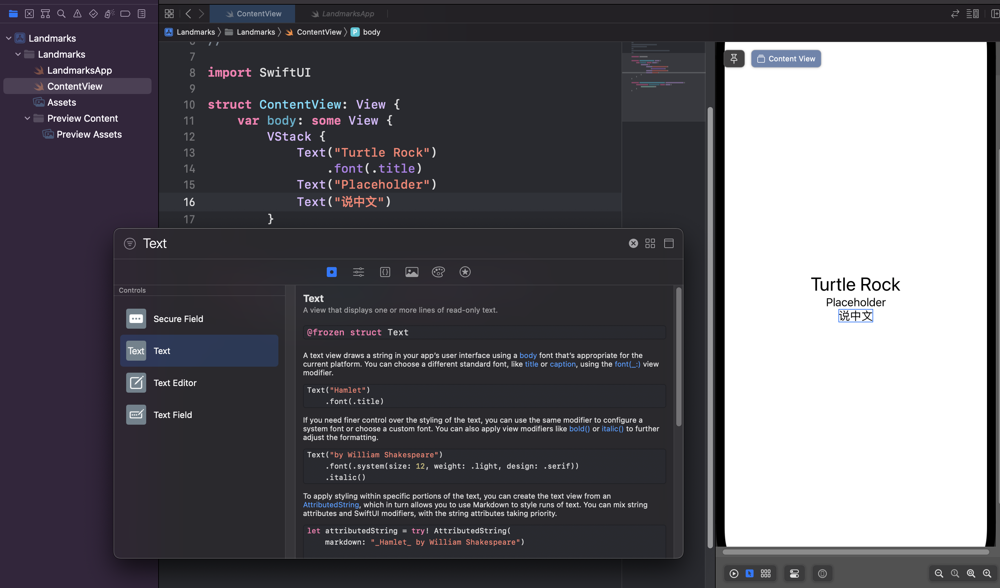

[swiftUI参考教程](https://developer.apple.com/tutorials/swiftui/creating-and-combining-views)

首先是要熟悉我们的开发环境Xcode，打开软件后，选择新建项目，我们的项目属性应该是iOS上的app，再之后为我们的新项目取上名字，就叫Landmarks，接口选择swiftUI，语言选择swift，取消勾选Include Test（简单点）。

接下来，资源管理器中就会默认生成hello world的代码，会自动在一台模拟出来的iPhone 14 Pro上输出hello world。

swift给我的第一感觉是和Java类似，类名和文件名一致，有莫名其妙的继承关系（App协议继承）。

但给人眼前一亮的是，可以直接在iPhone 14 Pro上面直接修改文字的属性，不过需要选择类似浏览器中的元素选择按钮，然后按住command，对某个元素点击后选择“展示swiftUI的检查器”，就可以修改文字格式，颜色 、甚至可以选择继承属性。

还有一点是，可以按住command键点击某个函数，比如Text，然后选择一些功能，下面以嵌入 VStack为例子（应该是以栈的形式，排列指定文字）。

这时候，代码中的Text函数就被`VStack{}`包含了。

接下来比较玄幻的东西来了，在右上角有个+，在搜索框中输入Text，选择最左边的一个图标（正方形中间一个空心圆），这是个筛选功能，然后找到Text，直接拖到Text函数的下面，然后奇迹般的出现了一行代码和对应界面。更不可思议的是，你可以像组装积木一样，把刚刚的Text拖到iPhone上，也可以直接出现。在这个+里面，还可以看函数的实例用法，简直不要太方便。

