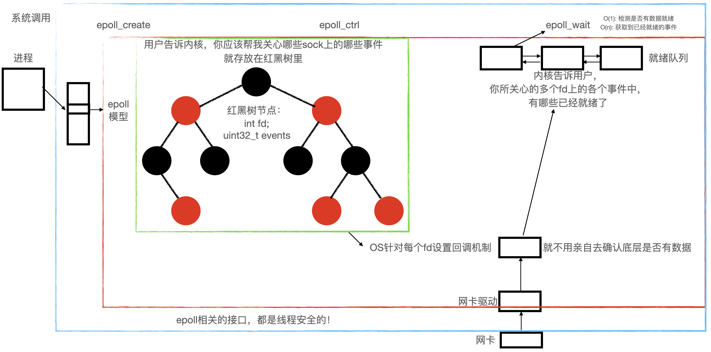

# I/O 复用

## 一、I/O的概念

在Linux系统中，I/O（输入/输出）指的是计算机系统的数据交换过程，包括从外部设备读取数据（输入）和将数据发送到外部设备（输出）。I/O操作是Linux系统中非常重要的一个方面，因为大多数应用程序都需要读取和写入数据。

在Linux中，I/O可以分为两类：阻塞I/O和非阻塞I/O。阻塞I/O指的是应用程序在进行I/O操作时会一直等待直到I/O操作完成后才能继续执行，而非阻塞I/O则允许应用程序在进行I/O操作的同时继续执行其他操作。

此外，Linux还提供了异步I/O和多路复用I/O。异步I/O指的是应用程序发起一个I/O操作后可以立即返回并继续执行其他操作，当I/O操作完成后再通过回调函数通知应用程序；而多路复用I/O则允许应用程序同时监视多个I/O操作的状态，从而在I/O操作可用时立即处理它们。

在Linux系统中，I/O操作通过系统调用来实现。常见的I/O系统调用包括read、write、open、close、select、poll、epoll等。这些系统调用允许应用程序与系统内核进行交互，从而实现I/O操作。

## 二、I/O 模型

### 2.1 背景知识

#### 2.1.1 操作系统如何知道网卡中有数据

不同设备通过网络进行I/O 时，传输的数据会经过网卡，数据到来时，是如何通知操作系统的？

在Linux中，操作系统通过网络接口卡驱动程序（network interface card driver）来与网卡进行通信，并实现数据的传输和接收。当网卡中有数据到达时，**网卡驱动程序会通过中断（interrupt）机制向操作系统内核发送一个中断信号，通知操作系统有数据到达**。

中断是一种CPU硬件机制，用于处理设备或程序发出的信号或事件。当网卡中有数据到达时，网卡会向CPU发送一个中断请求信号（Interrupt Request，IRQ），通知CPU需要处理该事件。操作系统内核会响应该中断请求，保存当前处理的上下文，并跳转到中断处理程序（Interrupt Service Routine，ISR）中处理该事件。

中断处理程序是一段特殊的程序代码，用于响应中断事件并处理相应的数据。在网络接口卡驱动程序中，中断处理程序会读取网卡中的数据，并将数据存储到操作系统内核的网络缓冲区中。然后，操作系统内核可以将数据传递给应用程序进行处理，或者将数据转发给其他设备进行处理。

需要注意的是，在高负载的情况下，中断处理程序可能会导致系统的性能瓶颈，因此Linux操作系统提供了一些优化机制，如基于轮询的中断处理程序（Polling Interrupt Service Routine，PISR）和中断合并（Interrupt Coalescing），以提高系统的性能和响应速度。

简单来说，是通过中断程序。外设中有数据时发送中断程序给CPU，CPU再把其数据拷贝到内存。

#### 2.1.2 什么是高效的IO

高效的I/O是指操作系统在进行输入输出（I/O）操作时，能够以最快的速度完成数据传输，同时减少CPU等其他资源的使用，提高系统的性能和效率。

实现高效的I/O需要考虑以下几个方面：

1. 避免阻塞I/O：阻塞I/O会使得应用程序在等待I/O操作完成时一直处于等待状态，从而浪费CPU资源，降低系统性能。采用非阻塞I/O或异步I/O可以避免这种情况。
2. 减少上下文切换：I/O操作需要在用户空间和内核空间之间切换，这种切换需要消耗CPU资源。减少上下文切换可以提高I/O操作的效率。
3. 优化I/O缓冲机制：操作系统通常会使用缓冲区来存储I/O数据，优化缓冲机制可以提高数据传输的效率。例如，采用预读取、预写入等技术可以避免重复的I/O操作。
4. 选择合适的I/O接口和设备：不同的I/O接口和设备对数据传输的效率有影响。选择高效的I/O接口和设备可以提高数据传输的速度和效率。
5. 使用多线程和多进程：多线程和多进程可以实现并发的I/O操作，提高系统的处理能力和响应速度。

对于I/O复用，主要是通过减少等待时间，而提高效率。

### 2.2 五种I/O 模型

我们可以通过一个钓鱼的例子来解释不同类型的I/O模型。

假设你在岸边钓鱼，以下是不同I/O模型的解释：

1. 阻塞式I/O：你使用阻塞式I/O模型时，当你抛出鱼竿后，你必须一直等待鱼儿上钩。你不能做其他事情，直到你感觉到有重量在你的鱼竿上。在这种情况下，你被阻塞，只有等待直到有新的数据可供处理。
2. 非阻塞式I/O：如果你使用非阻塞式I/O模型时，当你抛出鱼竿后，你可以做其他事情，例如看书或聊天。你只需要每隔一段时间检查你的鱼竿，看看是否有鱼上钩。这种方式允许你在等待I/O完成时同时进行其他操作。
3. 信号驱动型I/O：在信号驱动型I/O模型中，你会设置一个信号处理程序（比如在鱼竿上系一个铃铛）来通知你何时有鱼上钩。当你抛出鱼竿后，你可以离开岸边，但是你必须将信号处理程序注册到操作系统中，以便在有鱼上钩时自动通知你。
4. 异步I/O：在异步I/O模型中，你将在抛出鱼竿后告诉操作系统（帮你钓鱼的人）通知你何时有鱼上钩，然后你可以离开岸边。当有鱼上钩时，操作系统将通知你，并让你知道鱼的大小。这种方式允许你在等待I/O完成时同时进行其他操作。
5. 多路转接：多路转接是一种特殊的I/O模型，它允许你在多个I/O操作之间切换。这意味着你可以同时监视多个鱼竿，而不必等待一个鱼竿上的鱼上钩。你可以抛出多个鱼竿，并在有鱼上钩时自动通知你。这种方式可以提高I/O操作的效率和吞吐量。

下面通过《UNIX网络编程卷1》的内容介绍五种模型。

#### 2.2.1 阻塞式I/O

此例中基于UDP，将函数recvfrom视为系统调用。

**进程调用recvfrom，从用户区切换到内核区，发现无数据报准备好，开始等待，直至准备好，然后将数据从内核拷贝至用户空间，完成拷贝后返回成功指示，最后处理数据报。**

*此系统调用直到数据报到达且拷贝到缓冲区或是出错才返回，出错一般是被信号中断。*

#### 2.2.2 非阻塞式I/O

当我们把一个套接口设置为非阻塞方式时，即通知内核：当请求的I/O 操作非得让进程睡眠不能完成时，不要让进程睡眠，而应返回一个错误。

**进程调用recvfrom，内核此时无数据报准备好，返回一个EWOULDBLOCK错误，进程再次调用recvfrom，如果内核依旧无数据，会一直重复上述过程。如果内核数据报已准备好，则拷贝数据报到缓冲区，拷贝完成后，recvfrom返回成功指示，最后进程处理数据报。**

*当一个进程对一个非阻塞描述字不断重复调用recvfrom时，此过程可称为“轮询(polling)”。这种过程对CPU时间是极大的浪费*

#### 2.2.3 I/O 复用模型

有了I/O 复用，我们可以调用select 或poll，在这两个系统调用中的某一个上阻塞，而不是阻塞于真正的I/O 系统调用。

**进程调用select系统调用，如果内核中无数据报准备，就受阻于select调用，等待可能多个套接口中的任一个变为可读。如果数据包准备好，select返回可读条件。接下来进程调用recvfrom，从内核拷贝数据报到用户空间，完成后返回成功指示，最后进程处理数据报。**

*我们阻塞于select调用，等待数据报套接口可读。当select返回套接口可读条件时，我们调用recvfrom将数据报拷贝到应用缓冲区中。*

**与阻塞I/O 相比，似乎没有显示什么优越性，还多了一个系统调用。实际上，相比阻塞式I/O，I/O复用的优势在于可以同时监视多个文件描述符的状态，从而避免了多个阻塞式I/O的等待时间叠加。**

#### 2.2.4 信号驱动 I/O 模型

我们也可以用信号，让内核在描述字准备好时用信号SIGIO通知我们，此方法即为信号驱动 I/O

**首先，我们允许套接口进行信号驱动I/O，并通过系统调用 sigaction 安装一个信号处理程序。此系统调用立即返回，进程继续工作，它是非阻塞的。当数据报准备好被读时，就为该进程生成一个SIGIO信号。我们随即可以在信号处理程序中调用 recvfrom 来读数据报，最后处理数据报。**

#### 2.2.5 异步 I/O 模型

我们让内核启动操作，并在整个操作完成后（包括将数据从内核拷贝到我们自己的缓冲区）通知我们。这种模型和信号驱动模型相比：信号驱动是由内核通知我们何时启动一个 I/O 操作，而**异步 I/O 模型是由内核通知我们 I/O 操作何时完成**。

**我们调用函数`aio_read`函数，给内核传递描述字、缓冲区指针、缓冲区大小（与read相同的三个参数）、文件偏移（与lseek类似），并告诉内核当整个操作完成时如何通知我们。此系统调用立即返回，我们的进程不阻塞于等待I/O 操作的完成。我们要求内核在操作完成时生成一个信号，此信号直到数据已拷贝到应用缓冲区才产生，然后递交在`aio_read`中指定的信号，程序处理信号，再处理数据报。**


## 三、 接口介绍

### 3.1 fcntl 设置非阻塞I/O

在 Linux 中，可以使用 fcntl 函数来设置文件描述符为非阻塞IO。fcntl 函数可以用于对已打开的文件描述符进行各种操作，包括设置文件描述符的属性、锁定文件以及获取文件状态等。

下面是一个示例代码，演示如何将文件描述符 fd 设置为非阻塞IO：

```c++
#include <fcntl.h>
#include <unistd.h>
#include <errno.h>
#include <string.h>
#include <iostream>

using namespace std;

int setNonBlocking(int fd) {
    int flags = fcntl(fd, F_GETFL, 0);
    if (flags == -1) {
        cerr << "获取文件描述符属性失败：" << strerror(errno) << endl;
        return -1;
    }
    if (fcntl(fd, F_SETFL, flags | O_NONBLOCK) == -1) {
        cerr << "设置非阻塞IO失败：" << strerror(errno) << endl;
        return -1;
    }
    return 0;
}

int main() {
    int fd = 0; // 假设需要设置为非阻塞IO的文件描述符为0，即标准输入
    if (setNonBlocking(fd) == -1) {
        cerr << "设置非阻塞IO失败" << endl;
        return -1;
    }
    cout << "设置非阻塞IO成功" << endl;
    return 0;
}
```

在上述代码中，我们定义了一个 setNonBlocking 函数来设置文件描述符为非阻塞IO。**该函数首先获取文件描述符的属性 flags，然后通过 OR 操作将 O_NONBLOCK 标志添加到 flags 中，最后使用 fcntl 函数将新的属性值设置为文件描述符的属性。**

需要注意的是，如果文件描述符本身就是非阻塞IO的，则添加 O_NONBLOCK 标志并不会产生任何效果。**在使用非阻塞IO的过程中，需要注意处理 EAGAIN 和 EWOULDBLOCK 错误，这些错误表示当前操作需要等待更多数据或等待操作完成。** 

如果不进行上述处理，对该非阻塞的文件描述符进行read，我们的read是非阻塞的，一旦检测到底层没有数据就绪，我们的IO接口，会出错返回-1，但这并不是真正的错误，而是因为没有接收到数据。
可以通过errno来判断错误原因：数据没有就绪时，errno的值是EAGAIN或者EWOULDBLOCK，要处理可以用 ` if(errno == EAGAIN || errno == EWOULDBLOCK)` 判断。


*在 Linux 系统中，errno 是一个全局变量，用于保存最近一次系统调用或库函数调用失败的错误码。errno 定义在 errno.h 头文件中。*


在 Linux 中，fcntl 是一个用于对已打开的文件描述符进行各种操作的**系统调用**。fcntl 可以用于设置文件描述符的属性、锁定文件以及获取文件状态等。fcntl 的原型如下：

```c
#include <fcntl.h>

int fcntl(int fd, int cmd, ... /* arg */);
```

其中，fd 表示文件描述符，cmd 表示需要执行的命令，arg 表示命令参数。fcntl 函数的返回值取决于所执行的命令。

fcntl 的一些常用命令如下：

- F_DUPFD：复制文件描述符。
- F_GETFD：获取文件描述符标志。
- F_SETFD：设置文件描述符标志。
- **F_GETFL：获取文件状态标志。**
- **F_SETFL：设置文件状态标志。**
- F_GETLK：获取文件锁。
- F_SETLK：设置文件锁。
- F_SETLKW：设置文件锁（阻塞方式）。

在使用 fcntl 函数时，需要注意以下几点：

- fcntl 函数可以对任何打开的文件描述符进行操作，包括标准输入、标准输出、网络套接字等。
- fcntl 函数的返回值与命令有关，一般情况下返回 0 表示执行成功，否则返回 -1，并设置 errno。
- 命令参数 arg 可以是一个指针，指向一个与命令有关的结构体，用于传递更多的参数。
- 在使用 fcntl 函数设置文件描述符属性时，需要用 OR 操作将属性值添加到原有的属性值中。
- 在使用 fcntl 函数设置文件锁时，需要使用 F_SETLK 和 F_SETLKW 命令，分别表示设置非阻塞锁和阻塞锁。

常用的 fcntl 命令包括 F_GETFL 和 F_SETFL，用于获取和设置文件状态标志。这些标志包括 O_RDONLY（只读）、O_WRONLY（只写）、O_RDWR（读写）、O_APPEND（追加）、O_CREAT（如果文件不存在则创建）、O_TRUNC（截断文件）、O_EXCL（在创建文件时检查文件是否存在）等。这些标志可以通过 OR 操作组合使用，例如 O_RDWR | O_CREAT 表示以读写模式打开文件，并在文件不存在时创建文件。

在 Linux 中，fcntl 函数是一个系统调用，可以直接在用户程序中调用。一些高级语言（如 C++）也提供了对 fcntl 函数的封装，可以通过库调用的方式使用。但是，需要注意的是，在使用库调用时，需要按照库的规范进行参数传递等操作，以避免出现错误。


### 3.2 多路转接

多路转接和IO复用是两个相关但不完全相同的概念。

IO复用是一种异步IO模型，**它允许一个进程同时监视多个文件描述符（包括socket、标准输入输出等），并在有数据可读或可写时进行相应的处理，而不需要阻塞等待**。常用的IO复用函数包括 select、poll、epoll 等。

多路转接（Multiplexing）是一种实现IO复用的技术，**它允许一个进程同时监听多个网络连接（如多个客户端连接），并在有数据可读或可写时进行相应的处理**。多路转接的实现方式包括多线程、多进程、多路复用等。其中，多路复用就是一种基于IO复用的多路转接方式，它利用 IO 复用函数来同时监听多个文件描述符的事件，并在有事件发生时进行相应的处理。

因此，IO复用和多路转接是相关的概念，可以互相转化和结合使用。在 Linux 系统中，通常**使用 IO 复用函数来实现多路转接**，如使用 epoll 函数来同时监听多个客户端连接事件，并在有数据可读或可写时进行相应的处理。


#### 3.2.1 select

##### 3.2.1.1 接口说明

在 Linux 系统中，select 是一种 IO 复用函数，用于同时监听多个文件描述符（包括 socket、标准输入输出等）的事件，并在有数据可读或可写时进行相应的处理。其原型如下：

```c
#include <sys/select.h>

int select(int nfds, fd_set *readfds, fd_set *writefds, fd_set *exceptfds, struct timeval *timeout);
```

其中，参数 nfds 表示文件描述符集合中最大描述符值加 1；参数 readfds、writefds 和 exceptfds 分别表示可读、可写和异常事件的文件描述符集合；参数 timeout 表示 select 函数的超时时间，若为 NULL 则表示无限等待。

*以readfds为例*
*作用：所有关心读事件的文件描述符，都应该添加在这个集合中。*
*输入：用户告诉内核，os你要帮我检测一下在这个集合中的fd的读事件*
*输出：内核告诉用户，你关心的fd，有哪些文件描述符已经就绪了，可以读取了。*

##### 3.2.1.2 使用流程和注意事项

select 函数的使用流程如下：

1. 首先需要清空文件描述符集合，并将需要监听的文件描述符添加到对应的集合中，如下所示：

```c
fd_set rfds; // 可读文件描述符集合
FD_ZERO(&rfds); // 初始化为空集合
FD_SET(sockfd, &rfds); // 将 sockfd 添加到可读集合中
```

**FD_SET 是一个宏**，定义在 sys/select.h 头文件中，用于**将指定的文件描述符添加到文件描述符集合中**。其原型如下：

```c
void FD_SET(int fd, fd_set *set);
```

其中，参数 fd 表示要添加的文件描述符，参数 set 表示要添加到的文件描述符集合。

**文件描述符集合是一个位图结构**，每个文件描述符对应集合中的一个位。因此，**在使用 FD_SET 函数时，实际上是把 fd 对应的位设置为 1，从而表示该文件描述符已经被添加到集合中**。

*`fd_set`中，比特位的位置，代表文件描述符编号，从低位到高位，0，1，2……*
*比特位的内容代表是否关心（读等事件）*

需要注意的是，文件描述符集合有一定的大小限制，通常为 1024 或 2048 个位。因此，在使用 FD_SET 函数时需要特别注意集合大小的设置，以防止超出限制。*fd_set是一种具体的类型，在具体平台上，该类型的大小是确定的。所以select只能够进行检测确定数量的文件描述符。*

*并且参数set是一个输入输出型参数，它的弊端在于：使用同一个变量，每次调用返回的时候，原来的参数会被返回值覆盖，再要传参时，都要进行重新设置。*

另外，**使用 FD_SET 函数添加文件描述符到集合中后，需要使用 FD_ISSET 函数来检查文件描述符是否有事件发生**，如下面第三部分所示。

2. 然后调用 select 函数进行监听，并设置超时时间，如下所示：

```c
struct timeval tv; // 超时时间
tv.tv_sec = 5; // 秒
tv.tv_usec = 0; // 微秒
int ret = select(sockfd + 1, &rfds, NULL, NULL, &tv); // 监听可读事件
```

3. 在 select 函数返回后，需要检查各个文件描述符集合中的文件描述符是否有事件发生，如下所示：

```c
if (ret == -1) {
    perror("select");
} else if (ret == 0) {
    printf("timeout\n");
} else {
    if (FD_ISSET(sockfd, &rfds)) {
        // sockfd 有数据可读
        // ...
    }
}
```

需要注意的是，select 函数在监听文件描述符时，会阻塞当前进程直到有事件发生或超时。因此，在使用 select 函数时需要特别注意超时时间的设置，以防止进程长时间阻塞。

另外，**select 函数的效率较低，对文件描述符进行遍历比较耗时，而且一次只能监听有限数量的文件描述符**。因此，在 Linux 系统中，通常使用更高效的 IO 复用函数，如 epoll 函数，来实现多路复用。

##### 3.2.1.3 select 服务器端

核心框架伪代码
```c
while(1)
{
	int fd_array[];
	for()	;	//添加所有的sock到fd_set集合中
	maxfd;

	select();
	
	for();	//根据fd_array[]检测哪些sock已经就绪
	add sock to fd_array[];	//for();
	read/write/error
}
```

具体代码

[利用多路转接之select写的服务端](https://gitee.com/Yan_feiyu/linux_cpp/commit/b570c2b9d219f800eb0a88bbddd040c3180eb3dd)

[重置版地址](https://gitee.com/Yan_feiyu/mac--win/tree/main/mycode/linux/IOMultiplexing/select)

##### 3.2.1.4 select 缺点

每次调用select，都需要手动设置fd集合，从接口使用角度来说也非常不便，
每次调用select，都需要把fd集合从用户态拷贝到内核态，这个开销在fd很多时会很大
同时每次调用select都需要在内核遍历传递进来的所有fd，这个开销在id很多时也很大
select支持的文件描述符数量太小.

#### 3.2.2 poll

##### 3.2.2.1 接口说明

在Linux系统中，poll()是一种用于异步I/O操作的系统调用，它可以让程序等待多个文件描述符上的I/O事件。poll()函数会一直阻塞直到有一个或多个文件描述符上有I/O事件发生或者超时。

poll()函数的参数如下：

```C
int poll(struct pollfd *fds, nfds_t nfds, int timeout);
```

其中，fds是一个指向结构体数组的指针，每个结构体描述了一个文件描述符及其关注的事件类型。nfds是fds中结构体的数量。timeout是超时时间，单位是毫秒。

pollfd结构体的定义如下：

```C
struct pollfd {
    int fd;          // 文件描述符
    short events;    // 定义关注的事件类型（如 POLLIN、POLLOUT 等）
    short revents;   // 实际发生的事件类型
};
```

##### 3.2.2.2 使用流程和注意事项

用法如下：

1. 调用poll()函数前，需要将要关注的文件描述符及其对应的事件类型填入fds结构体数组中。
2. 调用poll()函数，等待I/O事件。
3. 当poll()函数返回时，可以通过遍历fds数组获取每个文件描述符发生的事件类型，即revents字段的值。

poll()函数的返回值表示有多少个文件描述符发生了事件，或者在超时时间内没有任何事件发生。返回值为负数表示出错。

**poll()函数的优点是可以同时监听多个文件描述符，而且不需要像select()函数一样需要不断地重新构造fd_set结构体。** 但是，当关注的文件描述符数量较多时，poll()函数的性能会有所下降。

*timeout 设置为0时代表非阻塞轮询，设置为-1时代表阻塞等待，设置为大于0的数代表等待时间。*

##### 3.2.2.3 poll 服务器端

[基于多路转接之poll接口写的服务器](https://gitee.com/Yan_feiyu/linux_cpp/commit/c3d8bc9fa5de711a8dd3d7572e6454a3718b5ce3)

[重置版地址](https://gitee.com/Yan_feiyu/mac--win/tree/main/mycode/linux/IOMultiplexing/poll)

##### 3.2.2.4 poll的缺点

poll中监听的文件描述符数目增多时
（1）和select函数一样，poll返回后，需要轮询pollfd来获取就绪的描述符
（2）每次调用poll都需要把大量的pollfd结构从用户态拷贝到内核中。
（3）同时连接的大量客户端在一时刻可能只有很少的处于就绪状态，因此随着监视的描述符数量的增长，其效率也会线性下降.

#### 3.2.3 epoll

##### 3.2.3.1 接口说明

在Linux系统中，epoll是一种高效的I/O多路复用机制，它可以让程序同时处理多个文件描述符上的I/O事件。相比于select和poll，epoll在处理大量文件描述符时的性能更好。

epoll使用三个系统调用：`epoll_create`、`epoll_ctl`和`epoll_wait`。头文件为`#include <sys/epoll.h>`

1. `epoll_create`：创建一个epoll实例，返回一个文件描述符（`epoll_fd`）来指向创建的epoll实例。

```C
int epoll_create(int size);
```

其中，size参数表示epoll实例中可以关注的文件描述符的最大数量。

2. `epoll_ctl`：注册或者注销一个文件描述符。

```C
int epoll_ctl(int epoll_fd, int op, int fd, struct epoll_event *event);
```

其中，`epoll_fd`是epoll实例的文件描述符，fd是待注册或注销的文件描述符，op可以取`EPOLL_CTL_ADD`（注册）、`EPOLL_CTL_MOD`（修改）和`EPOLL_CTL_DEL`（注销）。

*op分别为：*
*（1）注册一个文件描述符fd，到epfd中。*
*（2）修改已经注册的fd中的监听事件。*
*（3）从epfd中删除一个fd*

event是一个`epoll_event`结构体，表示fd关注的事件类型。

以下是 epoll_ctl 函数的返回值和对应的含义：

- 成功：返回0，表示操作成功执行。
- 失败：返回-1，表示操作失败。此时需要检查 errno 变量以确定错误类型，常见的错误类型包括：
  - EBADF：指定的文件描述符无效。
  - EEXIST：尝试添加已经存在的文件描述符。
  - EINVAL：指定的 epoll 实例无效，或者指定的文件描述符无效，或者尝试修改未注册的文件描述符。
  - ENOMEM：内存不足，无法分配内存以保存新的事件结构体。

需要注意的是，在使用 epoll_ctl 函数时，应该始终检查其返回值以确保操作成功执行。如果返回-1，则应该根据错误类型采取适当的措施，例如关闭文件描述符或释放资源等。

3. `epoll_wait`：等待一个或多个文件描述符上的I/O事件。

```C
int epoll_wait(int epoll_fd, struct epoll_event *events, int maxevents, int timeout);
```

其中，`epoll_fd`是epoll实例的文件描述符，events是一个指向`epoll_event`结构体数组的指针，表示发生I/O事件的文件描述符和事件类型，maxevents是events数组中元素的数量，timeout是等待超时时间，单位是毫秒。当一个或多个文件描述符上发生I/O事件时，`epoll_wait`返回，返回值表示发生I/O事件的文件描述符数量。

- epoll将会把发生的事件赋值到events数组中(events不可以是空指针，内核只负责把数据复制到这个events数组中，不会去帮助我们在用户态中分配内存)。
- maxevents告知内核这个events有多大，这个maxevents的值不能大于创建epoll_create时的size
- 参数timeout是超时时间（毫秒，0会立即返回，-1是永久阻塞).
- 如果函数调用成功，返回对应IO上已准备好的文件描述符数目，如返回0表示已超时，返回小于0表示函数失败

`epoll_event`结构体的定义如下：

```C
typedef union epoll_data {
    void *ptr;
    int fd;
    uint32_t u32;
    uint64_t u64;
} epoll_data_t;

struct epoll_event {
    uint32_t events;    // 定义关注的事件类型（如 EPOLLIN、EPOLLOUT 等）
    epoll_data_t data;  // 用户数据
};
```

epoll的优点在于：

1. 高效：epoll使用红黑树和链表数据结构管理关注的文件描述符，能够快速地响应大量文件描述符上的I/O事件。
2. 只关注发生了事件的文件描述符：`epoll_wait`仅会返回发生I/O事件的文件描述符，而不是返回所有注册的文件描述符。
3. 与非阻塞I/O配合使用：epoll可以与非阻塞I/O配合使用，提高程序的性能。

epoll的一些缺点：

1. 对代码的复杂度要求高：epoll的使用需要对I/O模型和事件驱动编程有一定的了解，对代码的复杂度要求较高。
2. 只能在Linux中使用：epoll是Linux特有的机制，不支持在其他操作系统中使用。

##### 3.2.3.2 epoll 的工作原理



##### 3.2.3.3 epoll 服务器端

[基于多路转接之epoll写的服务器](https://gitee.com/Yan_feiyu/linux_cpp/commit/49328b5594d5e43656b9b299034740761745b213)

[重置版地址](https://gitee.com/Yan_feiyu/mac--win/tree/main/mycode/linux/IOMultiplexing/epoll)

##### 3.2.3.4 epoll 的工作方式

工作方式是指：底层有数据之后，OS向上层进行通知的方式。
比如，当tcp的接收缓冲区中有数据时，也会存在不向上通知的情况。
（1）LT：水平触发
只要底层有数据，就会向上层一直通知，直到上层将数据全部取完。
即便时上层没有把数据全部取走，我们也不担心，因为还有下一次机会。
（2）ET：边缘触发
只有底层数据，**从无到有**，**从有到多**的时候，会向上层进行通知就绪，否则一律不通知。即便上层取走了数据，可能还是有残留。
这就使得其通知有效次数居多。
倒逼上层要取，就一定要将自己本次的数据全部取走，将报文尽快成型，上层报文尽快被处理。

水平触发就像是：一个快递员拿着你网购的三个快递，打电话让你来取，你却迟迟不来，快递员就反复打电话催你。
边缘触发就像是：一个快递员催你拿快递，你迟迟不来的时候他也不打电话，自己忙活别的去，当他又收到你另外的几个快递，还会给你打电话，告诉你再不来我就走了，倒逼你去取完。

ET模式下，会倒逼程序员取走所有就绪数据，但程序员不能立即知道底层还剩多少数据。但是可以进行尝试，进行循环读取，一直到读取返回值告诉我们没有数据了！
有可能碰到，前几次读全部满足，只不过最后一次已经把底层读完了（但是我们不知道），后续一定会再read，此时read会被阻塞挂起！导致整个服务被挂起！所以在ET下，读取必须是非阻塞的读取！

基于ET模式的epoll就是Reactor
底层一旦有数据，我们上层就能立马进行处理，并且不用我们主动等待。
就像打地鼠一样。

[单进程基于ET模式实现的一个Reactor模式，并实现了在线加法器](https://gitee.com/Yan_feiyu/linux_cpp/commit/8134e9f5bfe22896bc50824c1ce0dc3c697f127a)

[重置版——可读性更好的代码和多种运算符号](https://gitee.com/Yan_feiyu/mac--win/tree/main/mycode/linux/IOMultiplexing/Reactor)