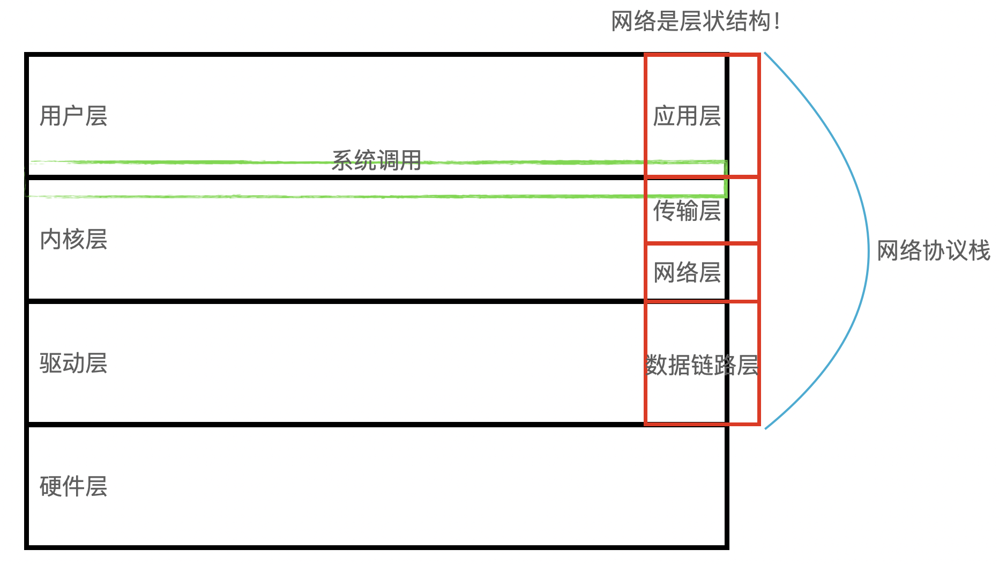
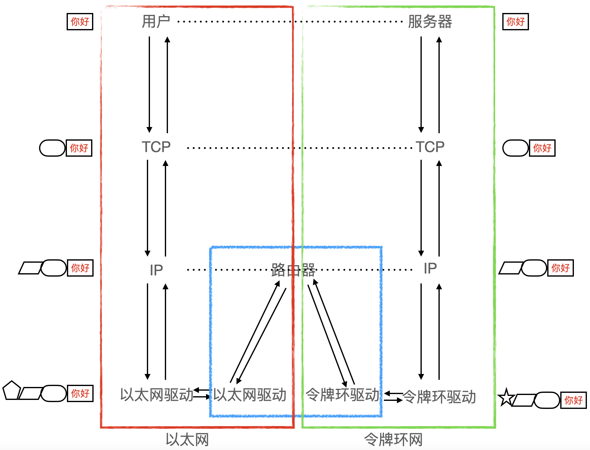

写在前面：这篇博客暂时没有参考任何之前的课程笔记，是因为在进行编写IO复用的服务器时，遇到了许多网络接口陌生和不会使用，所以暂时记录部分知识点在下面，后面会进行和课程笔记内容整合。

## socket
Linux 中的 socket() 函数原型如下：

```c
#include <sys/types.h>
#include <sys/socket.h>

int socket(int domain, int type, int protocol);
```

其中，各参数的含义如下：

- domain：指定 socket 的协议族，它可以是以下之一：

    - AF_INET：IPv4 网络协议。
    - AF_INET6：IPv6 网络协议。
    - AF_UNIX：Unix 域协议，用于在同一计算机上的进程之间进行通信。
    - AF_NETLINK：Linux 内核通信协议。
    - 等等。

- type：指定 socket 的传输方式，它可以是以下之一：

    - SOCK_STREAM：面向连接的流式传输方式，使用 TCP 协议。
    - SOCK_DGRAM：无连接的数据报传输方式，使用 UDP 协议。
    - SOCK_RAW：原始套接字，可以直接访问网络层协议。
    - 等等。

- protocol：指定 socket 使用的协议，通常设置为 0，表示使用默认协议。

返回值：

- 如果调用成功，返回一个非负整数，表示新创建的 socket 的文件描述符。
- 如果调用失败，返回 -1，并设置 errno 变量来指示错误类型。

总之，socket() 函数是 Linux 中用于创建 socket 的函数，它的原型中指定了协议族、传输方式和协议等参数，并返回新创建的 socket 的文件描述符。

## exit
在 C++ 中，exit() 是一个用于终止程序的函数，它定义在标准库头文件 cstdlib 中。当程序执行到 exit() 函数时，它会立即退出，不再执行后面的语句，同时释放程序所占用的所有资源。

exit() 函数可以接受一个整型参数，表示程序终止时的返回值。这个返回值可以被其他程序或者操作系统用来判断程序的执行结果。通常情况下，返回值为 0 表示程序正常退出，而其他值则表示程序异常退出或者出现错误。

需要注意的是，exit() 函数会立即终止程序，因此在调用它之前必须确保程序已经完成了所有必要的操作，并正确释放了所占用的资源。否则，可能会导致程序出现未定义的行为或者内存泄漏等问题。

此外，如果程序中存在全局对象，它们的析构函数可能不会被调用，因为 exit() 函数不会执行 C++ 程序的清理工作。为了确保全局对象的析构函数被正确调用，可以使用 atexit() 函数来注册一个清理函数，在程序退出时执行。

## linux服务器进程挂掉后，再次启动会出现无法绑定端口，该如何解决
使用 SO_REUSEADDR 选项。
可以在绑定端口前设置 SO_REUSEADDR 选项，该选项可以让内核允许重用处于 TIME_WAIT 状态的端口。这样，在进程退出后，该端口就可以立即被新的进程绑定使用。
```c++
int optval = 1;
setsockopt(sockfd, SOL_SOCKET, SO_REUSEADDR, &optval, sizeof(optval));
```
SO_REUSEADDR 是一个套接字选项，用于控制套接字的行为。它允许在同一端口上绑定多个套接字，即使在 TIME_WAIT 状态下的套接字仍然存在。当一个套接字在 TIME_WAIT 状态下时，它将不能立即被新的套接字绑定使用。而使用 SO_REUSEADDR 选项可以让内核允许重用处于 TIME_WAIT 状态的套接字。

当一个套接字套接字使用 SO_REUSEADDR 选项时，内核将允许多个套接字在同一端口上绑定。如果两个套接字绑定了相同的端口，内核将选择先到达的套接字来处理该端口的数据。这种情况下，后到达的套接字将无法接收到该端口的数据。因此，在使用 SO_REUSEADDR 选项时，需要确保多个套接字之间不会产生冲突，否则可能会导致数据丢失或者混淆。

使用 SO_REUSEADDR 选项时需要注意以下几点：

1. SO_REUSEADDR 只能在 bind() 函数调用之前设置，否则将无效。

2. SO_REUSEADDR 只对 TCP 套接字有效，对于 UDP 套接字无效。

3. SO_REUSEADDR 选项只是让内核允许重用处于 TIME_WAIT 状态的套接字，但并不能保证新的套接字一定会绑定成功，还需要满足其他条件，如端口未被占用等。

4. 使用 SO_REUSEADDR 选项可能会导致安全问题，因为它允许任意进程绑定已经被占用的端口。因此，在使用 SO_REUSEADDR 选项时应该注意安全性。

总之，SO_REUSEADDR 选项可以让内核允许重用处于 TIME_WAIT 状态的套接字，在同一端口上绑定多个套接字。使用 SO_REUSEADDR 选项需要注意安全性和冲突问题，以确保多个套接字之间不会产生冲突，并且不会引入安全问题。

setsockopt() 函数是 Linux 系统中用于设置套接字选项的函数。它的原型如下：

```c++
#include <sys/types.h>
#include <sys/socket.h>

int setsockopt(int sockfd, int level, int optname,
               const void *optval, socklen_t optlen);
```

其中，sockfd 表示要设置选项的套接字描述符；level 表示选项所在的协议层，常用的协议层有 SOL_SOCKET、IPPROTO_TCP、IPPROTO_IP 等；optname 表示要设置的选项名称；optval 表示选项值的指针；optlen 表示选项值的长度。

setsockopt() 函数可以用于设置各种套接字选项，例如：

1. SO_REUSEADDR：允许在同一端口上绑定多个套接字。

2. SO_KEEPALIVE：启用 TCP keepalive 机制，检测连接是否已经断开。

3. SO_SNDBUF 和 SO_RCVBUF：设置发送缓冲区和接收缓冲区的大小。

4. TCP_NODELAY：禁用 Nagle 算法，提高数据传输效率。

5. IP_TTL：设置 IP 数据包的生存时间（TTL）。

setsockopt() 函数的返回值为 0 表示设置成功，-1 表示设置失败，错误码保存在 errno 中。

总之，setsockopt() 函数是 Linux 系统中用于设置套接字选项的函数，可以用于设置各种套接字选项，提高网络通信效率和安全性。


## bind
bind() 函数是 Linux 中用于将套接字绑定到指定地址和端口号的函数，其原型如下：

```c++
#include <sys/types.h>
#include <sys/socket.h>

int bind(int sockfd, const struct sockaddr *addr, socklen_t addrlen);
```

其中，sockfd 表示要绑定的套接字描述符；addr 表示指向要绑定的地址结构体的指针；addrlen 表示地址结构体的长度。

在调用 bind() 函数时，需要先创建一个套接字（如 socket() 函数），然后将其绑定到指定的地址和端口号。地址结构体可以是 sockaddr、sockaddr_in、sockaddr_in6 等类型，具体使用哪种类型取决于要绑定的地址类型（IPv4 或 IPv6）。

bind() 函数的返回值为 0 表示绑定成功，-1 表示绑定失败，错误码保存在 errno 中。常见的绑定失败的原因包括端口已经被占用、地址不可用等。

除了基本的用法，bind() 函数还有一些需要注意的细节：

1. 如果要绑定的地址是通配地址（如 0.0.0.0 或 ::），则表示绑定到所有可用的网络接口上。如果要绑定到指定的网络接口上，则需要指定具体的 IP 地址。

2. 如果要绑定的端口号是 0，则表示由内核自动分配一个未被占用的端口号。在实际的网络编程中，通常会指定一个固定的端口号。

3. 在使用 IPv6 地址时，需要使用 sockaddr_in6 结构体，而不是 sockaddr_in 结构体。此外，由于 IPv6 地址比 IPv4 地址长，所以在使用 bind() 函数时需要将 addrlen 参数设置为 sizeof(struct sockaddr_in6)。

4. 在绑定之前，需要将 sockaddr_in 或 sockaddr_in6 结构体中的地址和端口号设置正确。例如，如果要将套接字绑定到本地的 8080 端口上，则需要设置如下：

```c++
struct sockaddr_in addr;
memset(&addr, 0, sizeof(addr));
addr.sin_family = AF_INET;
addr.sin_port = htons(8080);
addr.sin_addr.s_addr = htonl(INADDR_ANY);
```

其中，AF_INET 表示使用 IPv4 地址，htons() 函数将端口号从主机字节序转换为网络字节序，htonl() 函数将地址从主机字节序转换为网络字节序，INADDR_ANY 表示绑定到所有可用的网络接口上。

`struct sockaddr_in`是一个用于表示IPv4地址的结构体，定义在`<netinet/in.h>`头文件中。它的定义如下：

```
struct sockaddr_in {
    sa_family_t sin_family;  // 地址族（Address Family），通常为AF_INET
    in_port_t sin_port;      // 端口号，使用网络字节序（big-endian）表示
    struct in_addr sin_addr; // IPv4地址，使用网络字节序（big-endian）表示
    char sin_zero[8];        // 保留字段，通常设置为0
};
```

其中，`sin_family`表示地址族，通常为`AF_INET`，即IPv4地址族。`sin_port`表示端口号，使用网络字节序（big-endian）表示。`sin_addr`表示IPv4地址，也使用网络字节序（big-endian）表示，它是一个`struct in_addr`类型的结构体。`sin_zero`是一个保留字段，通常设置为0。

在使用`struct sockaddr_in`时，通常需要先将IPv4地址和端口号转换为网络字节序，可以使用`htons()`和`htonl()`等函数进行转换。例如，下面的代码将IPv4地址和端口号转换为网络字节序，并将它们赋值给`sockaddr_in`结构体的相应字段：

```
struct sockaddr_in server_addr;
server_addr.sin_family = AF_INET;
server_addr.sin_port = htons(8080);
server_addr.sin_addr.s_addr = htonl(INADDR_ANY);
memset(server_addr.sin_zero, 0, sizeof(server_addr.sin_zero));
```

其中，`htons()`函数用于将主机字节序（little-endian）的端口号转换为网络字节序（big-endian），`htonl()`函数用于将主机字节序的IPv4地址转换为网络字节序，`INADDR_ANY`表示绑定到所有可用的网络接口上。

## listen

在Linux中使用socket API中的listen函数来将一个socket转换为被动监听模式，它的原型如下所示：

```c
int listen(int sockfd, int backlog);
```

其中，sockfd参数是要被转换为被动监听模式的socket文件描述符，backlog参数是指内核允许在socket队列中排队的最大连接数。

如果调用成功，listen函数返回0，否则返回-1并设置errno变量来指示错误原因。


## u_int16_t

在Linux中，`u_int16_t`是一个无符号的16位整数类型，定义在头文件`<stdint.h>`中。它是C标准库中定义的一个标准整数类型，用于确保整数类型的大小和有符号/无符号性，在不同的平台和编译器中具有一致的表现。

`u_int16_t`类型通常用于网络编程和底层设备驱动程序中，因为在这些领域中，需要确保数据的二进制格式和大小的一致性，以便在不同的计算机和操作系统之间进行正确的数据交换和通信。

`u_int16_t`类型的范围是从0到65535，它可以被定义为以下方式之一：

```c
typedef unsigned short u_int16_t;
```

或者

```c
#include <stdint.h>
```

在实际编码中，可以使用`u_int16_t`类型来声明变量、函数参数或返回类型，以确保程序的可移植性和正确性。 

## fd_set 的大小
在 Linux 中，`fd_set` 的大小由 `FD_SETSIZE` 宏定义决定，默认情况下 `FD_SETSIZE` 的值为 1024，因此 `fd_set` 的大小也是 1024 bit，即 128 字节（1024 / 8 = 128）。

需要注意的是，`fd_set` 的实际大小可能会因编译器和系统的不同而有所差异，但是通常都是按照 `FD_SETSIZE` 宏定义的大小进行分配的。因此，在使用 `fd_set` 时，应该始终使用 `FD_SETSIZE` 宏定义来表示集合的大小，而不是使用固定的值。

## close
在 Linux 中，`close()` 是一个系统调用，用于关闭已打开的文件描述符（file descriptor）。其函数原型定义在 `unistd.h` 头文件中，如下所示：

```c
#include <unistd.h>

int close(int fd);
```

其中 `fd` 是需要关闭的文件描述符。调用 `close()` 函数后，内核会释放与该文件描述符相关的资源，并且在关闭文件描述符之前，会将输出缓冲区中的数据刷新到文件中。

`close()` 函数的返回值是一个整数，表示调用执行的结果。如果关闭成功，返回值为 0，否则返回值为 -1，并设置全局变量 `errno` 表示错误原因。常见的错误原因包括文件描述符无效、文件描述符已经关闭等。

需要注意的是，关闭文件描述符并不一定意味着关闭了文件本身，因为一个文件可能被多个进程共享，只有当所有打开该文件的进程都关闭了文件描述符，才能真正地关闭文件。此外，关闭文件描述符并不会自动将文件从磁盘上删除，需要使用 `unlink()` 等函数来删除文件。

在使用 `close()` 函数时，需要注意遵循以下规则：

- 不要重复关闭同一个文件描述符，否则可能会导致不可预测的行为。
- 在多线程程序中，需要注意保护共享的文件描述符，以避免多个线程同时关闭同一个文件描述符。
- 如果 `close()` 函数返回 -1，需要根据 `errno` 的值来判断错误原因，并采取相应的措施。


## accept

在Linux中，accept()是套接字编程中用于接受来自客户端连接请求的系统调用，它通常与socket()、bind()和listen()等函数一起使用。

accept()函数的语法如下：

```c
#include <sys/types.h>
#include <sys/socket.h>

int accept(int sockfd, struct sockaddr *addr, socklen_t *addrlen);
```

其中，sockfd是socket文件描述符，addr和addrlen是指向struct sockaddr结构体的指针和其长度的指针，用于存储客户端的IP地址和端口信息。

当客户端连接请求到达服务器时，accept()函数会创建一个新的套接字来处理该连接，并返回一个新的文件描述符，该文件描述符与客户端的套接字相连。服务器可以使用该文件描述符与客户端通信。

需要注意的是，accept()函数是一个阻塞函数，也就是说服务器在调用accept()函数时，如果没有客户端连接请求到达，服务器会一直阻塞等待，直到有客户端连接请求到达为止。为了避免服务器一直阻塞等待，可以使用非阻塞IO或多路复用技术来实现异步处理客户端连接请求。

将sockaddr_in类型转换为sockaddr类型是为了满足accept函数的参数要求。sockaddr是一个通用的地址结构体类型，可以容纳不同协议族的地址信息，而sockaddr_in结构体是IPv4协议族中特定的地址结构体类型，仅适用于IPv4协议族的地址信息。通过将sockaddr_in类型转换为sockaddr类型，我们可以在不同的协议族之间进行通用的地址传递和操作。

## recv
在 Linux 中，`recv` 是一个用于接收数据的系统调用，用于从一个已连接的套接字接收数据。它的原型定义如下：

```c
#include <sys/types.h>
#include <sys/socket.h>

ssize_t recv(int sockfd, void *buf, size_t len, int flags);
```

这个函数有四个参数：

- `sockfd`：表示要接收数据的套接字的文件描述符。
- `buf`：表示一个指向接收缓冲区的指针，用于存储接收到的数据。
- `len`：表示接收缓冲区的长度，即可以接收的最大数据量。
- `flags`：表示接收数据的行为选项，可以通过设置不同的标志来实现不同的功能，例如 MSG_WAITALL 表示等待直到接收到指定长度的数据。

`recv` 函数会从指定的套接字接收数据，并将数据存储在指定的接收缓冲区中。它返回值为接收到的数据的字节数，或者在出现错误时返回 -1。在接收数据时，可能会出现以下错误：

- `EAGAIN` 或 `EWOULDBLOCK`：表示套接字设置为非阻塞模式，并且当前没有数据可用。
- `EBADF`：表示套接字文件描述符无效。
- `EFAULT`：表示接收缓冲区指针无效。
- `EINVAL`：表示套接字已关闭或者不支持接收操作。
- `ENOTCONN`：表示套接字未连接。
- `ENOTSOCK`：表示文件描述符不是一个套接字。

需要注意的是，`recv` 函数只能用于已连接的套接字，如果要接收数据的套接字未连接，需要先使用 `connect` 函数将其连接到目标地址。此外，为了确保接收到完整的数据，通常需要在一个循环中多次调用 `recv` 函数，直到接收到指定长度的数据或者遇到错误为止。

总之，accept 函数用于接受客户端的连接请求，并返回一个新的套接字来处理与该客户端的通信；而 recv 函数用于从已连接的套接字上接收数据。

## DEBUG日志
我使用Postman向我的服务器发送信息时，我的服务器礼貌回复，但杯具了，Postman看不到发送的消息。原来，我的服务器是基于TCP协议的，而Postman在我之上，是HTTP协议，这就不难怪Postman解析不了我发的报文。
于是就使用了telnet向我的服务器发送消息，果然能收到我的服务器的礼貌回复。
但在之前，我犯了个滑稽的错误，我没记得telnet的命令是这样的telnet 127.0.0.1 8080
而是telnet 127.0.0.1:8080
因为报错，这才使我用上Postman，好用但协议不匹配。
我想我可以继续试试将回复报文改为HTTP格式，这样说不定Postman也能接受服务器的礼貌回复，又不用再使用telnet蹩脚的命令了，哈哈当然我是开玩笑的。

## EPOLLET
在Linux的 epoll I/O 多路复用机制中，EPOLLET 宏用于设置事件触发方式。EPOLLET 是 epoll 的边沿触发模式，这种模式下，当有数据可读或可写时，epoll_wait 函数会通知应用程序，然后应用程序可以立即处理该事件，而无需像水平触发模式下那样等待数据缓冲区填满。EPOLLET 模式可以提高 I/O 处理的效率，但需要注意以下几点：

1. 当使用 EPOLLET 模式时，一定要确保在处理事件时读取所有可用数据，否则可能会导致事件丢失。
2. EPOLLET 模式只适用于非阻塞 I/O 操作，因为在阻塞 I/O 操作中，即使在边缘触发模式下，epoll_wait 函数也会一直等待直到有数据可读或可写。
3. 在使用 EPOLLET 模式时，应用程序需要更加谨慎地处理事件，因为该模式下可能会出现事件重复触发的情况。

总之，EPOLLET 宏是在 Linux epoll I/O 多路复用机制中设置事件触发方式的一种方式，它可以提高 I/O 处理的效率，但需要谨慎处理事件以避免出现问题。


# 一、Linux网络基础知识

## 1.1 网络的层状结构



Linux网络通常按照OSI（开放系统互联）参考模型中的七层结构来组织，每一层都有特定的功能和责任，包括：

1. 物理层（Physical Layer）：**负责在物理媒介上传输比特流**，例如**电缆、光纤**等。

2. 数据链路层（Data Link Layer）：负责**将比特流转换为帧，并进行错误检测和纠正**，例如**以太网、Wi-Fi**等。

3. 网络层（Network Layer）：负责**在不同的网络之间传输数据，包括寻址、路由和分组传输**等，例如**IP协议**。

4. 传输层（Transport Layer）：负责**数据传输的可靠性和顺序性**，包括**TCP和UDP协议**等。

5. 会话层（Session Layer）：负责**建立、管理和终止会话**，例如**SMB协议**。

6. 表示层（Presentation Layer）：负责**数据的格式转换和编解码**，例如**ASCII码和JPEG格式**等。

7. 应用层（Application Layer）：负责**提供各种网络应用程序**，例如**HTTP、FTP、SMTP**等。

在Linux系统中，网络协议栈的实现通常是通过内核模块来实现的，不同的协议负责不同的网络功能。


物理层+数据链路层：站在2进制角度，通过光电信号的方式，把数据信号发送给多方。

网络层：如何找到目标主机的问题

传输层：如果在路上数据丢失，需要保证可靠性，丢失了就重传。

应用层：对传输过来的数据，按照之前的约定（应用层协议），来完成某种“计算”的需求。

## 1.2 网络协议

### 1.2.1 基本概念

协议本质上就是一种**约定**。

举个例子，在读大学的时候和父母约定，为了节省电话费，根据电话铃响的时间来发送不同信息：响1秒代表报平安，响2秒代表缺钱了，响3秒代表需要接电话。

*（以上只是举例子方便了解协议的概念，要是现实中真这样，那估计也难办。只能通过微信发数字的方式取代）*


计算机之间的协议就是：互相通信时，传递一个字节，字节对应的每个值，表示的是不同的含义，含义双方已经达成共识。

所谓的网络协议本质是：通过数据的表达方式，来完成参与通信的各个主机协议的表现。


### 1.2.2 协议分层

协议也是分层的，分层的好处是：**各层协议再通信时不会感知到其它层的协议**。

比如当我们在打电话的时候，我们只能体验到和对方直接通话的过程，而不会体验到我们的声音被转换为电磁波，再被传输，最后被对端解码出说话声。

**在使用者的角度来看，每层协议间都是直接通信，但实际中并不是直接通信。**

分层还有一个好处是：**可以随时替换任何一层协议**，而不用换掉所有的协议。

比如可以用手机通信，也可以使用无线电对讲机通信。


一般通信的时候，都是由应用层发起数据通信。

信息会被向下传递，每到一层就会被添加上报头，向上传递时会被去掉报头。

这样看来，每层都能识别相应的报头，就像是每层都在直接通信。

自顶向下为封装的过程，自底向上是解包和分用的过程。

每层协议，都必须解决两个问题：

1、能够将自己的报头和有效载荷进行分离。

2、每次协议的报头中一定包含了一个字段：标识要将自己的有效载荷交付给上层的哪一个协议！ 


什么叫做报头？什么又叫做封装？

报头和有效载荷都是数据！封装就是把报头和有效载荷拷贝到一起。

在应用层，只需处理程序细节；向下三层，处理通信细节。

就类似于网购，用户只需在app中选好商品，运输过程无需用户关心，是快递公司完成。


## 1.3 网络设备

### 1.3.1 集线器

集线器（Hub）是计算机网络中**用于连接多台计算机或其他网络设备**的设备。它**将多个设备连接到一个中央节点，从而形成一个共享的物理媒介，使得它们可以相互通信**。**工作在物理层，类似中转驿站。**

集线器最常见的类型是传统的以太网集线器，它通常具有多个 RJ-45 端口，可用于连接多台计算机或其他网络设备。当一个设备向集线器发送数据时，集线器会将数据复制到所有连接的端口上，以确保所有设备都能收到数据。这种方式称为广播（Broadcasting），因为数据被广播到所有设备上。

由于集线器采用了广播方式，因此当网络中的设备数量增加时，网络的性能会受到限制。这是因为当多个设备同时发送数据时，它们会产生冲突，从而导致数据包的丢失和重传，进而影响网络的性能。因此，现代网络通常使用交换机（Switch）代替集线器，以提高网络性能和可靠性。

### 1.3.2 交换机

交换机（Switch）**可以连接多台计算机，使它们能够互相通信**。交换机**在局域网（LAN）中广泛使用**，它可以**实现分组转发和广播，以及协调网络中各个节点的通信。**

交换机与集线器相似，但它比集线器更加智能化和高效。**集线器将数据包从一个端口复制到所有其他端口，而交换机则根据目标MAC地址将数据包发送到目标设备的端口，而不会发送到所有设备**。这种针对目标设备的转发方式称为**分组转发（Packet Switching）**，它可以**减少网络拥塞和冲突，提高网络传输效**率。

**交换机还可以识别不同的网络协议，例如TCP/IP、FTP等，根据协议类型进行数据包的处理和转发**。同时，**交换机还支持虚拟局域网（VLAN）的功能，可以将不同的设备划分到不同的网络中，提高网络安全性和管理效率。**

### 1.3.3 路由器

路由器是一种计算机网络设备，它允许多个设备（如电脑、手机、平板等）通过有线或无线方式连接到互联网或局域网。**路由器的主要功能是将数据包从一个网络传输到另一个网络**，通常在家庭或办公室中用于连接宽带调制解调器和本地网络。

路由器有多个网络接口，包括一个广域网（WAN）接口和一个或多个本地网络（LAN）接口。WAN接口通常用于将路由器连接到互联网服务提供商的调制解调器，而LAN接口则用于将多个设备连接到本地网络。

**路由器还可以实现网络地址转换（NAT）**，这是一种将私有IP地址（如10.0.0.0/8、172.16.0.0/12和192.168.0.0/16）转换为公共IP地址的技术，从而使本地网络中的设备可以访问互联网。

现代路由器通常还具有其他功能，如无线接入点、虚拟专用网络（VPN）支持、质量服务（QoS）等。


# 二、局域网通信

## 2.1 MAC

在同一局域网中的两台主机是可以直接通信的。

下面举个例子：在教室里，老师对张三说为什么你的作业没有完成，这句话教室里所有的同学都能听到，但只有张三会站起来说忘写了，这句话也会被教室里所有人听到，但只有老师会进行回复。老师和张三各自都认为他们是在一对一进行对话。

张三之所以能识别这句话是对自己说的，是因为叫了自己的名字。

在局域网中，就需要每一台主机有自己的身份标识（MAC地址）

在Linux系统中查看MAC地址`ifconfig -a`

ether字段后形如 `00:aa:11:bb:22:33`的字段即为MAC地址。

MAC地址：网卡的一个SN（序列号），全球唯一，6字节的标识符。

## 2.2 以太网

以太网是一种计算机网络技术，它是在局域网中广泛使用的一种标准。局域网是指一个相对较小的网络，通常包括一个建筑物、一个办公室或者一个校园内的多个设备。因此，以太网通常被用作局域网的基础网络技术。

局域网中的设备可以使用以太网协议进行通信，这样它们就可以共享资源，例如打印机、文件共享等。以太网提供了一种可靠的、高效的数据传输方式，使得局域网中的设备可以快速、准确地发送和接收数据。

以太网还提供了一些其他的功能，例如冲突检测和数据重传，这些功能可以帮助局域网中的设备避免数据冲突和数据丢失。因此，以太网是局域网中非常重要的一个组成部分，它可以帮助设备之间进行高效的通信，并提高整个局域网的性能和可靠性。

## 2.3 数据碰撞

在一个局域网内，主机之间的通信会被所有主机看到，但是要确认是否是发给自己的，如果不是就会丢弃掉。 

局域网中，数据如果被多台主机同时发出，容易发生数据碰撞。

任何一个时刻，局域网中，只允许一台机器在向网络发送数据！

每台主机都有识别碰撞的能力！每台主机都要执行碰撞避免算法。

所以，局域网也被叫做碰撞域。

就好比，如果教室里大家都在互相说话，那么谁也听不清楚谁的。


局域网内的数据碰撞指的是当两个或多个设备同时尝试发送数据包到同一个目标设备时发生的冲突。在传统的以太网中，当两个设备同时发送数据包时，它们的信号会在网络上相遇并产生冲突，这会导致数据包的丢失。

发生数据碰撞的原因通常是因为多个设备同时尝试在同一个时间内发送数据包，这可能是由于网络拥塞、设备故障或通信协议错误等原因导致的。当数据碰撞发生时，网络上的设备会检测到冲突并发送一个特殊的信号来通知其他设备停止发送数据，这个信号被称为冲突检测信号。

为了解决数据碰撞的问题，以太网采用了一种称为CSMA/CD（Carrier Sense Multiple Access with Collision Detection，带冲突检测的载波感应多路访问）的协议。在这种协议中，设备在发送数据包之前会先监听网络上的信道，以确保没有其他设备正在发送数据。如果有其他设备正在发送数据，则设备会等待一段时间后再重新尝试发送数据包，以避免数据碰撞的发生。

随着网络技术的不断发展，现代局域网中采用了更先进的协议和技术来避免数据碰撞的发生，例如交换机和路由器等网络设备可以帮助分离网络上的流量，避免数据碰撞的发生。


局域网被其中所有主机共享，且只能有一台主机进行一次访问。

局域网的本质：一份临界资源！

当局域网内的设备增多时，就需要交换机了。

交换机的作用：划分碰撞域。


# 三、跨网络通信

跨网络通信，必须要路由器，做到数据包转发的功能。

路由器是跨网络传输，要求路由器至少有两个网络接口！一个LAN口，一个WAN口。

路由器是工作在网络层的设备，但不仅仅是工作在网络。

## 3.1 IP

IP地址是指互联网协议地址，是网络中用于唯一标识设备的数字地址。IP地址通常由32位二进制数字组成，被分为四个8位二进制数字，以点分十进制表示。例如，192.168.1.1是一个常见的IPv4地址。

IP地址由两部分组成：网络地址和主机地址。网络地址用于标识网络，主机地址用于标识具体的设备。在互联网中，IP地址是网络通信的基础，它使得数据能够在不同的设备之间传输。

IPv4是目前使用最广泛的IP地址版本，它使用32位二进制数字，共有约42亿个可用地址。随着互联网的发展和设备数量的增加，IPv4地址已经不足以支持所有设备的连接需求，因此IPv6被开发出来，它使用128位二进制数字，可提供远远超过IPv4的地址空间。


### 3.1.1 两个地址

为什么会存在两个地址，即IP地址和MAC地址？

举个唐僧取经的例子方便理解：唐僧从东土大唐出发，去往西天取经。路上会途径一座座城池，比如到了女儿国，唐僧会问国王：“我从东土大唐而来，要去往西天取经，下一站应该去哪里呢？”

从哪里来，到哪里去？即源IP和目的IP，它们是路由器进行路径选择的核心依据！

上一站从哪里来，下一站去哪里？即源MAC地址和目的MAC地址。

MAC只考虑在局域网中使用，而IP是可以跨网络的。


首先发送信息的机器也需要有一定的路由能力，就好像唐僧从长安城出发一定要走西门一样，那么机器也需要知道发送的信息是发送给局域网内的某台机器，还是跨局域网传输。


## 3.2 跨网络通信过程

跨网络通信的过程可以分为以下几个步骤：

1. 发送端将数据进行封装：在发送端，数据被封装进一个或多个网络协议的数据包中，每个数据包包含源地址、目标地址、数据内容等信息。

2. 发送端将数据包发送到网络：数据包从发送端的计算机通过网络传输到接收端的计算机，传输的过程中需要经过多个网络路由器和交换机等网络设备。

3. 数据包在网络中传输：在网络中传输的过程中，数据包可能会经过不同的网络层次和不同的网络协议。每个网络设备都会根据数据包的目标地址和当前网络状态，选择最优的路由进行转发。

4. 接收端接收数据包：接收端的计算机接收到数据包后，会对数据包进行解析，并根据数据包中的目标地址将数据包交给相应的应用程序。

5. 接收端应用程序处理数据：接收端的应用程序会对接收到的数据进行处理，例如显示在屏幕上、存储到文件中等。

需要注意的是，在跨网络通信的过程中可能会遇到不同的问题，例如网络延迟、数据包丢失、网络拥塞等，需要通过各种技术手段进行优化和处理。


下面是描述路由器跨网络通信的过程的图片：



顺带科普一下令牌环网：

令牌环网（Token Ring）是一种计算机网络拓扑结构，它通过在一个环形的物理拓扑中传递令牌来实现共享网络资源。在令牌环网中，每个计算机都连接到一个环形的局域网中，并且只能通过持有一个特殊的数据包，即“令牌”，来访问网络资源。

当一个计算机需要访问网络资源时，它会等待令牌传递到自己的位置，并且将自己的数据包添加到令牌中，然后将令牌传递给下一个计算机。当数据包传递回原始发送者时，发送者会从令牌中删除自己的数据包，并将令牌传递给下一个计算机。

令牌环网在传输数据时可以保证数据传输的顺序，并且具有较低的冲突率和较高的可靠性。但是，令牌环网也存在一些缺点，例如传输速度较慢、网络故障时恢复时间较长等问题。由于这些缺点，现在令牌环网已经被更先进的技术所取代，如以太网等。


因为底层是不一样的，网络又是如何做到在IP及其之上，每一层之间可以没有任何差异呢？

因为有路由器的存在，可以做到不断的根据不同的局域网制式，进行解包和封包的过程，从而站在IP往上看，全网的网络是没有任何差别的！完成了一种网络虚拟化技术！IP网络！

在计算机网络中，以太网和令牌环网在底层物理层和数据链路层的实现方式不同，但它们在更高层次的协议（如网络层和传输层）上使用的协议是相同的，因此在IP层及其之上的网络协议上没有差异。

具体来说，无论是以太网还是令牌环网，它们都可以运行TCP/IP协议栈，该协议栈包括了网络层的IP协议和传输层的TCP/UDP协议。这些协议不受底层网络技术的影响，因此在IP层及其之上的网络协议上，以太网和令牌环网是相同的。


# 四、套接字编程

## 4.1 背景知识

### 4.1.1 套接字

我们把数据从一台机器，搬迁至另一台机器，是没有意义的！要处理数据或返回数据才有意义。

1、将数据跨网络；传送到目标主机，只是第一步！

2、对端主机，需要将收到的数据，交付给它的上层处理进程！

ip标识互联网中的唯一的一个主机（硬件），port（端口号）标识了一台主机上面的唯一的一个进程！ 

通信过程即为`src_ip:src_port<->dst_ip:dst_port`

ip+port标识互联网中的唯一的一个进程！

网络通信，本质是不同主机上的不同进程之间互相通信。

ip+端口号就称为socket

### 4.1.2 套接字编程概念

套接字编程（Socket Programming）是一种网络编程模型，它提供了一种在网络上进行通信的方式。套接字是一种通信端点，它可以用于在不同计算机之间传输数据。套接字编程可以用于开发各种网络应用程序，例如客户端-服务器应用程序、P2P 应用程序等。

在套接字编程中，使用的是基于 TCP 或 UDP 协议的套接字。TCP 协议提供了一种可靠的、面向连接的通信方式，它保证了数据传输的可靠性和顺序性，但是在传输效率方面可能会受到一定的影响。而 UDP 协议则提供了一种不可靠的、面向无连接的通信方式，它具有高效、低延迟的特点，但是在数据传输的可靠性和顺序性方面可能会存在问题。

套接字编程可以分为客户端和服务器端两个部分。在客户端，需要创建一个套接字并连接到服务器端；在服务器端，需要监听一个端口并接受客户端的连接请求。一旦连接建立，客户端和服务器端就可以通过套接字进行数据的收发。

套接字编程可以使用多种编程语言实现，例如 C、Python、Java 等。在不同的编程语言中，使用的套接字 API 可能略有不同，但是套接字编程的基本原理是相似的。

### 4.1.3 端口号 vs 进程id

#### 4.1.3.1 概念介绍

都是标识进程的唯一性，为什么需要两份？

端口号和进程ID是两个不同的概念。

端口号是一个16位的整数，用于标识网络中的不同应用程序。在TCP/IP协议中，每个应用程序都可以绑定一个端口号，并使用该端口号与其他应用程序进行通信。例如，Web服务器通常使用端口号80，SMTP服务器使用端口号25。

进程ID（Process ID）是一个唯一的标识符，用于标识正在运行的进程。每个进程都有一个唯一的进程ID，可以用于在操作系统中识别和管理进程。进程ID可以被操作系统分配或者由应用程序指定。

**端口号用于标识应用程序在网络中的通信端口，而进程ID用于标识正在运行的进程。**在网络通信中，应用程序需要绑定一个端口号，并将该端口号与其他应用程序进行通信。在操作系统中，每个运行的进程都有一个唯一的进程ID，可以用于在操作系统中进行进程管理和调度。

进程ID号和端口号的关系可以类比学生有学号和身份证号，在不同场景下有不同用处。

#### 4.1.3.2 进程与端口号绑定关系

一个进程可以绑定多个端口号，一个端口号不能被多个进程绑定。

在同一个时刻，一个端口号只能被一个进程绑定并占用。这是因为每个端口号都是一个唯一的标识符，用于标识网络中的不同应用程序。如果一个端口号被多个进程使用，那么就无法区分这些进程所对应的应用程序。

如果多个进程需要使用同一个端口号，可以采用以下两种方式之一：

1. 使用不同的IP地址：在同一个计算机上，可以使用**不同的IP地址来区分不同的进程**。这样，每个进程就可以绑定相同的端口号，但使用不同的IP地址。

2. 动态端口：动态端口是指由操作系统**自动分配的端口号**，通常范围从49152到65535。应用程序可以使用动态端口来避免与其他应用程序冲突。在建立网络连接时，操作系统会自动为应用程序分配一个未被占用的动态端口，并在通信结束后释放该端口。

可以类比一个同学可以学多个学院的课程（比如双学位），但一个学院中不能有重复的学号。

### 4.1.4 TCP和UDP协议

TCP（Transmission Control Protocol）是一种可靠的协议，它通过建立连接、数据包排序、确认和重传等机制来保证数据传输的可靠性。TCP适用于需要高可靠性的应用场景，如文件传输、电子邮件和电子支付等。

UDP（User Datagram Protocol）是一种不可靠的协议，它不需要建立连接，也不保证数据的可靠性。UDP适用于对实时性要求较高的应用场景，如语音通话、视频流传输等。

相比之下，TCP比UDP更为复杂，但数据传输的可靠性更高；而UDP则更为简单，在需要实时性较高的情况下更为合适。不同的应用场景需要选择适合的协议来完成数据传输。

两者没有谁好谁坏，只有谁更合适！


### 4.1.5 网络字节序

网络字节序（Network Byte Order）是一种规定好的数据存储方式，用于在不同计算机和操作系统之间进行数据传输和通信。在网络传输中，数据通常需要在不同的计算机和操作系统之间进行交互，但是不同的计算机和操作系统可能有不同的字节序（Byte Order），这会导致数据在传输过程中出现错误或解析错误的问题。因此，网络字节序的使用可以保证数据在不同系统之间的传输和解析的一致性。

网络字节序采用的是大端字节序（Big-endian），即高位字节存储在低地址，低位字节存储在高地址，这与人类阅读习惯是一致的。例如，在网络字节序下，十六进制数0x12345678在内存中的存储方式为0x12 0x34 0x56 0x78。

在网络编程中，经常需要将主机字节序（Host Byte Order）转换为网络字节序，或者将网络字节序转换为主机字节序。可以使用如htonl、htons、ntohl、ntohs等函数进行字节序转换。其中，htons和htonl用于将主机字节序转换为网络字节序，ntohs和ntohl则用于将网络字节序转换为主机字节序。

不同机器可能大小端存储的方式不同，所以规定所有跨主机通信发出的数据都为大端存储的方式。

1、数据按照字节为单位，有高权值位和低权值位之分。

2、空间有高地址和低地址之别。

将低权值放在低地址处，就是小端，反之为大端。  

接口中的英文字母

h:host 主机

n:net 网络

Linux操作系统使用了统一的接口实现了各种类型的套接字的通信。

但是没有使用void*是因为设计这套接口时，c还不支持void*